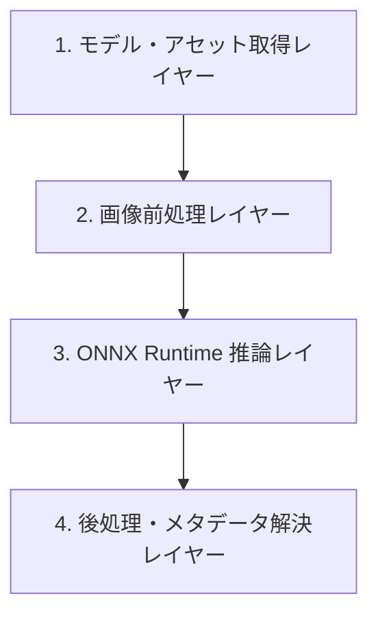

# ONNX 推論パイプラインの Python から Rust への移植スキル

このスキルは、Python の機械学習画像推論コード（特に ONNX Runtime を使用するもの）を Rust に高性能かつ頑健に移植するための手順とベストプラクティスを定めたものです。

---

## 1. 移植の全体フェーズ

Python の推論コードを Rust に移植する際は、以下の4つのレイヤーに分割して段階的に実装を進めます。



---

## 2. 各レイヤーの実装ガイドライン

### フェーズ 1: モデル・アセット取得レイヤー (`hf-hub` の活用)
Python の `huggingface_hub` によるモデルダウンロード処理は、Rust では `hf-hub` クレートを使用して等価に実装します。

- **設計のベストプラクティス**:
  - `hf-hub::api::sync::Api` を用いて、キャッシュディレクトリを汚さずにローカルにダウンロードおよびキャッシュ解決を行います。
  - モデル名やリポジトリ名から動的に `repo_id` を解決し、必要な `model.onnx` やメタデータ（`selected_tags.csv` 等）をロードします。

```rust
use hf_hub::api::sync::Api;

pub fn download_model_asset(repo_id: &str, filename: &str) -> Result<PathBuf, HubError> {
    let api = Api::new()?;
    let repo = api.model(repo_id.to_string());
    let path = repo.get(filename)?;
    Ok(path)
}
```

---

### フェーズ 2: 画像前処理レイヤー（Pillow との等価性）
最もバグや精度乖離が発生しやすいレイヤーです。Pillow の画像ロード・変換処理を Rust の `image` クレートで正確に再現する必要があります。

> [!WARNING]
> **画像処理アルゴリズムに関する重要事項**
> 本プロジェクトの PixAI Tagger モデルで成功した前処理（アスペクト比を歪める直接リサイズや特定色でのアルファブレンドなど）が、**他のモデル（例: オブジェクト検出、線画生成、セグメンテーションなど）でも同様に有効であるとは限りません。**
> 新しいモデルを移植する際は、必ずそのモデル独自の `preprocess.json` や Python 側のリサイズ・パディング・切り抜きロジック（アスペクト比維持パディング `pad_image_to_size` 等）を確認し、個別のアプローチを適用してください。

#### ① アルファチャンネル（透過画像）のブレンド処理
Python（Pillow）で透過 PNG 画像などを RGB モードで読み込む際、暗黙的に「白などの特定背景の上に画像をアルファブレンドした後に RGB 変換」されることがあります。Rust の `.to_rgb8()` はアルファ値を単に破棄して黒背景などにしてしまうため、以下のアルファブレンドを自前で実装します。

```rust
use image::{DynamicImage, ImageBuffer, Rgb, GenericImageView};

/// 画像がアルファチャンネルを持つ場合に、指定された背景色でアルファブレンドして RGB に変換します。
pub fn force_image_background(img: &DynamicImage, bg_color: [u8; 3]) -> DynamicImage {
    if img.color().has_alpha() {
        let (w, h) = img.dimensions();
        let mut canvas = ImageBuffer::from_pixel(w, h, Rgb(bg_color));
        let rgba_img = img.to_rgba8();
        
        for y in 0..h {
            for x in 0..w {
                let rgba_pixel = rgba_img.get_pixel(x, y);
                let alpha = rgba_pixel[3] as f32 / 255.0;
                let rgb_pixel = canvas.get_pixel_mut(x, y);
                
                // アルファブレンド物理計算
                rgb_pixel[0] = ((rgba_pixel[0] as f32 * alpha) + (bg_color[0] as f32 * (1.0 - alpha))).round() as u8;
                rgb_pixel[1] = ((rgba_pixel[1] as f32 * alpha) + (bg_color[1] as f32 * (1.0 - alpha))).round() as u8;
                rgb_pixel[2] = ((rgba_pixel[2] as f32 * alpha) + (bg_color[2] as f32 * (1.0 - alpha))).round() as u8;
            }
        }
        DynamicImage::ImageRgb8(canvas)
    } else {
        DynamicImage::ImageRgb8(img.to_rgb8())
    }
}
```

#### ② CHW 正規化テンソルの構築
ONNX モデルが要求する `[1, 3, H, W]` (NCHW) の浮動小数点テンソルを構築します。平均値 (`mean`) と標準偏差 (`std`) で正規化します。

```rust
use ndarray::Array4;

pub fn to_ndarray_chw(
    img: &DynamicImage,
    mean: &[f32; 3],
    std: &[f32; 3],
) -> Result<Array4<f32>, ImageError> {
    let (width, height) = img.dimensions();
    let mut array = Array4::zeros((1, 3, height as usize, width as usize));
    let rgb_img = img.to_rgb8();

    for (x, y, pixel) in rgb_img.enumerate_pixels() {
        let r = (pixel[0] as f32 / 255.0 - mean[0]) / std[0];
        let g = (pixel[1] as f32 / 255.0 - mean[1]) / std[1];
        let b = (pixel[2] as f32 / 255.0 - mean[2]) / std[2];

        array[[0, 0, y as usize, x as usize]] = r;
        array[[0, 1, y as usize, x as usize]] = g;
        array[[0, 2, y as usize, x as usize]] = b;
    }
    Ok(array)
}
```

---

### フェーズ 3: ONNX Runtime 推論レイヤー
Rust では `ort` クレート（通常 v2 系）を使用します。

- **設計のベストプラクティス**:
  - 推論セッションの初期化コストを抑えるため、マルチスレッド環境を考慮したセッションキャッシュ設計、またはスレッドセーフなラッパーを設計します。
  - 出力テンソルが複数ある場合は、名前で明示的に解決してデータを抽出します。

```rust
use ort::{Session, Value};

// テンソルの実行と出力抽出
pub fn run_inference(session: &mut Session, input_name: &str, input_tensor: &Array4<f32>) -> Result<Vec<f32>, InferenceError> {
    let inputs = ort::inputs![input_name => input_tensor.view()]?;
    let outputs = session.run(inputs)?;
    
    // 出力名の解決
    let output_value = outputs.get("prediction").ok_or("Output not found")?;
    let (_shape, prediction) = output_value.try_extract_tensor::<f32>()?;
    
    Ok(prediction.to_vec())
}
```

---

### フェーズ 4: 後処理・メタデータ解決レイヤー
モデルの出力確率配列（`f32` ベクタ）とメタデータ（CSV 等）を結びつけ、閾値判定、フィルタリング、ソートを行います。

- **設計のベストプラクティス**:
  - `csv` や `serde` クレートを使用し、静的なメタデータを安全かつ高速にシリアライズします。
  - 結果の順序性（確信度降順、同スコアの場合はアルファベット昇順など）を Python 側の API 定義と完全に同一にします。
