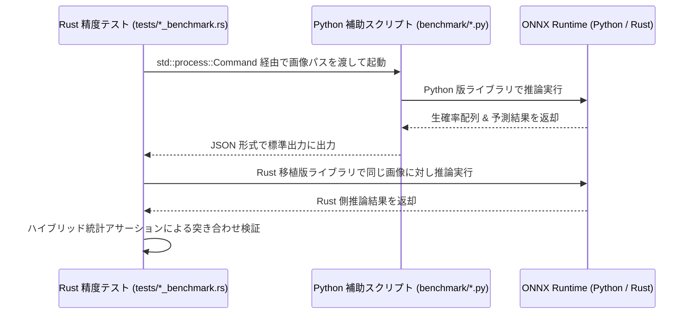

# 精度自動検証・ベンチマーク構築スキル

このスキルは、Python で構築された機械学習・画像解析モデルを Rust に移植した際、実画像を用いて両者の出力（確信度・タグ等）の数学的同等性を自動検証する「精度検証ベンチマーク環境」を構築するためのガイドラインです。

---

## 1. なぜ検証ベンチマークが必要か？

画像リサイズ処理（Pillow vs Rust `image`）やデコード処理の僅かな実装差によって、ニューラルネットワークに入力されるテンソルの各ピクセル値には数 LSB（最低位ビット）の微小な数値的差異が発生します。
これがニューラルネットワークの深層を通ることで増幅され、最終層の確信度に数 % 〜 15 % 程度の差異となって現れることがあります（**アドバーサリアル的過敏性**）。

このため、単一の値の厳密一致（`assert_eq!`）ではなく、**「推論結果が統計的に同一の性能水準を満たしていること」**を検証するテスト設計が不可欠となります。

---

## 2. 検証システムのアーキテクチャ

検証システムは、以下の図のように Rust 側から Python 側の推論をサブプロセスとして呼び出し、出力を動的に突き合わせるアーキテクチャを採用します。



---

## 3. Python 側補助スクリプトの設計

同一画像に対する「生確率配列」および「閾値適用後の解決済み結果」を標準出力に JSON 出力するスクリプトを `benchmark/` ディレクトリ内に作成します。

```python
# benchmark/run_python_tagger.py
import sys
import json
from imgutils.tagging.pixai import get_pixai_tags, _raw_predict

def main():
    image_path = sys.argv[1]
    
    # 解決済み結果の取得
    general, character = get_pixai_tags(image_path, model_name='v0.9')
    # 完全に厳密な浮動小数点誤差を突き合わせるための生確率の取得
    raw_outputs = _raw_predict(image_path, model_name='v0.9')
    prediction = raw_outputs['prediction'].tolist()
    
    print(json.dumps({
        "success": True,
        "general": general,
        "character": character,
        "prediction": prediction
    }))

if __name__ == '__main__':
    main()
```

---

## 4. ハイブリッド統計アサーションの設計

微小なリサイズ補間誤差によって境界上の特定のタグがブレる現象を安全に許容しつつ、全体としての正確さを厳密に検証するために、以下の**3つのハイブリッド指標**を組み合わせてアサーションを行います。

> [!TIP]
> **統計アサーションの3つの指標**
> 1. **一般タグ検出一致率 (IoU - Intersection over Union) >= 90.0%**
>    - 検出されたタグ集合全体のマクロレベルでの一致度をアサート。
> 2. **許容誤差（例: 4%）を超えるタグの割合 < 10.0%**
>    - 僅かなスコアズレで境界上をまたいだ少数のタグのブレ（局所的なアドバーサリアル変化）を統計的に許容。
> 3. **最大絶対誤差 < 18.0%**
>    - 特定のタグであっても、許容し得ない極端な推論ロジックのバグやチャンネル順序のミスによる大乖離を防止。

### Rust テストコードの実装テンプレート

```rust
// tests/pixai_benchmark.rs より抜粋

#[test]
#[ignore] // 重いテストのため cargo test -- --ignored でのみ実行
fn test_pixai_precision_and_benchmark() {
    let test_images = vec!["path/to/image1.jpg", "path/to/image2.png"];
    
    for rel_path in test_images {
        // 1. Python プロセスの呼び出し (uv を使用)
        let mut cmd = std::process::Command::new("uv");
        cmd.current_dir("imgutils")
           .args(&["run", "python", "../benchmark/run_python_tagger.py", &image_path]);
        let output = cmd.output().expect("Failed to execute Python process");
        let py_output: PythonTaggerOutput = serde_json::from_str(&String::from_utf8_lossy(&output.stdout)).unwrap();

        // 2. Rust 側の推論実行
        let image = image::open(&image_path).unwrap();
        let rust_result = get_pixai_tags(&image, "v0.9", None).unwrap();

        // 3. IoU (検出一致率) のアサーション
        let rust_keys: HashSet<&String> = rust_result.general.iter().map(|(k, _)| k).collect();
        let py_keys: HashSet<&String> = py_output.general.keys().collect();
        let intersection = rust_keys.intersection(&py_keys).count();
        let union = rust_keys.union(&py_keys).count();
        let tag_iou = intersection as f32 / union as f32;
        
        assert!(tag_iou >= 0.90, "一般タグの IoU 一致率が 90% 未満です: {:.2}%", tag_iou * 100.0);

        // 4. 個別スコアの誤差統計検証
        let mut exceeded_errors = Vec::new();
        let mut max_absolute_error: f32 = 0.0;
        let mut compared_count = 0;

        for (tag, rust_score) in &rust_result.general {
            if let Some(py_score) = py_output.general.get(tag) {
                let diff = (rust_score - py_score).abs();
                max_absolute_error = max_absolute_error.max(diff);
                compared_count += 1;
                
                if diff >= 0.04 { // 4%以上のズレを記録
                    exceeded_errors.push((tag.clone(), *rust_score, *py_score, diff));
                }
            }
        }

        let exceeded_ratio = exceeded_errors.len() as f32 / compared_count as f32;

        // 統計判定アサーション
        assert!(exceeded_ratio < 0.10, "誤差が4%を超えるタグの割合が多すぎます: {:.2}%", exceeded_ratio * 100.0);
        assert!(max_absolute_error < 0.18, "最大絶対誤差が許容限界(18%)を超えています: {:.4}", max_absolute_error);
        
        println!("🎉 検証パス！ 比較タグ数: {}, MAE: {:.4}", compared_count, mae);
    }
}
```
